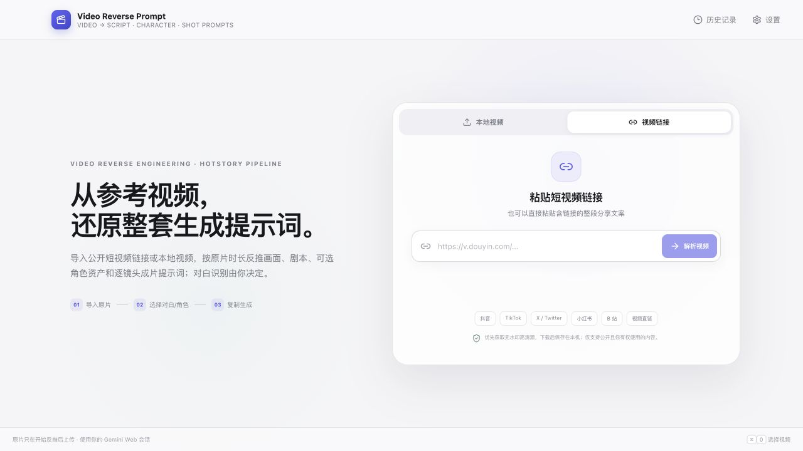
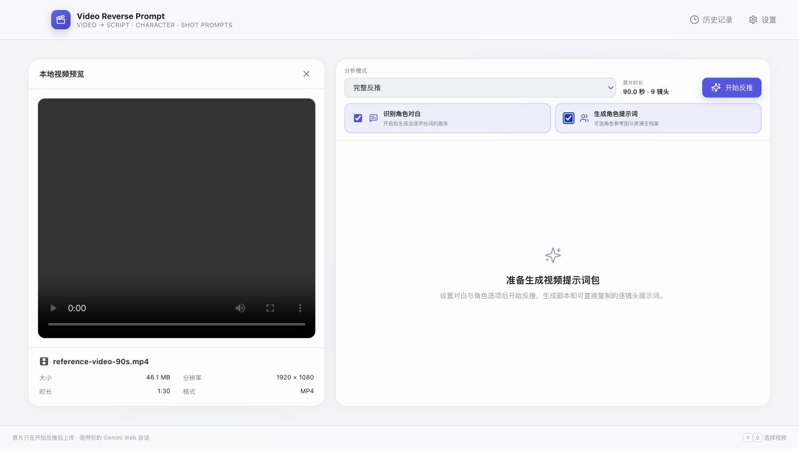

# Video Reverse Prompt

macOS / Windows 本地 AI 视频逆向导演工作台。导入一个参考视频后，应用会按原片时长生成视频总览、反推提示词、剧本、可选角色提示词，以及可直接复制给视频模型的逐镜头成片提示词。

应用复用 Chrome 中已登录的 Gemini Web 会话，不需要 Gemini API Key，也不读取或保存 Cookie、密码、OAuth Token 或 Authorization Header。





## 核心能力

- 只处理视频，不包含图片反推入口、图片模式或图片输出分区。
- 支持 MP4、MOV、M4V、WebM 本地视频。
- 支持粘贴抖音、TikTok、X / Twitter、小红书、B 站等公开短视频链接或完整分享文案。
- 按原视频时长拆镜头：镜头数为 `ceil(总时长 / 10 秒)`，时间码连续、无空隙、无重叠，单镜头不超过 10 秒。
- 「识别角色对白」关闭时只分析画面，输出不含台词、旁白和臆测人声的纯画面剧本。
- 「识别角色对白」开启时按说话人和时间码识别可辨对白；听不清时要求标记，不根据口型或剧情补写。
- 「生成角色提示词」可选：开启后生成稳定的 `[[CHAR_XX]]` 角色编号、三联棚拍角色参考图提示词、表演主档案和可选声线提示词。
- 逐镜头提示词包含第一帧、空间站位、表演、动作、手部、视线、道具、机位、单一运镜、焦点、物理、光线、色彩、材质与声音，可直接复制给 Seedance、Higgsfield、可灵、Veo、Runway 等视频模型。
- 结果按六个稳定分区整理，并保留完整 Raw 与结构化 JSON。

## 输出分区

| 分区 | 内容 |
|---|---|
| `VIDEO_OVERVIEW` | 原片时长、比例、镜头数、开关状态、主体、风格和声音概况 |
| `REVERSE_PROMPT` | 从第一帧到结束的完整视频复刻提示词 |
| `SCRIPT` | 与原时长一致的含对白剧本或纯画面剧本 |
| `CHARACTER_PROMPTS` | 可选角色参考图、视觉锚点、表演主档案和声线 |
| `SHOT_PROMPTS` | 每条不超过 10 秒、可独立复制的视频模型成片提示词 |
| `JSON` | 时长、角色、剧本段落和镜头时间码的结构化清单 |

## HotStory 提示词链路

本项目直接复用了 [HotStory](https://github.com/xgq947-ship-it/HotStory) 中角色资产、剧本生成、分镜规划和逐镜头成片提示词的职责设计，并内置一套可公开分发、开箱即用的完整工作流：

```text
视频证据
  → 剧本生成
  → lira-image-prompts 职责：角色与参考图提示词
  → acting-ai-video 职责：表演主档案与逐镜头适配
  → cinedance-higgsfield 职责：可直接生成视频的镜头调度
  → 六分区视频生成包
```

HotStory 原仓库只有三份 `SKILL.md` 的加载器和调用模板，并未提交三份原文本体；本机也未找到它们。因此本项目不会把内置工作流冒充成第三方 Skill 原文。

如果你拥有完整的三份 Skill，可以不改代码直接启用逐字加载。将它们放到以下任一位置：

```text
${VIDEO_REVERSE_PROMPT_SKILL_ROOT}/lira-image-prompts/SKILL.md
${VIDEO_REVERSE_PROMPT_SKILL_ROOT}/acting-ai-video/SKILL.md
${VIDEO_REVERSE_PROMPT_SKILL_ROOT}/cinedance-higgsfield/SKILL.md
```

也支持：

```text
./skills/{skill-name}/SKILL.md
~/.agents/skills/{skill-name}/SKILL.md
~/.codex/skills/{skill-name}/SKILL.md
```

只有三份文件全部存在时才会启用原文模式；否则安全回退到项目内置工作流。原文模式会把三份文件完整附加给 Gemini，不总结、不缩写、不截断，同时继续遵守视频证据边界、用户开关和六分区输出契约。

## 短视频链接导入

- 首页可切换「本地视频」与「视频链接」。
- 抖音优先使用无水印解析，TikTok 选择高清无水印源，X / Twitter 选择帖子中码率最高的 MP4。
- 普通 MP4、MOV、M4V、WebM 直链直接下载。
- 其他公开平台复用统一 Media Resolver。
- 临时 CDN 地址立即流式下载到应用缓存，限制为 1 GB；每次重定向都会重新校验公网地址并拒绝 localhost 与内网目标。
- 视频解析完成后只进入本地预览；用户点击「开始反推」后才会上传 Gemini。

## 环境

- macOS Apple Silicon 或 Windows 10/11 x64
- Google Chrome
- Node.js 22+ 与 Rust stable（仅源码开发需要）

正常的视频网页上传不依赖 FFmpeg。

## 开发启动

```bash
npm install
npm run tauri dev
```

macOS 也可以双击项目根目录中的 `Video Reverse Prompt 开发启动器.app`。启动器可以关闭、重新启动项目或打开运行日志。

仅用于前端视觉开发时：

```bash
npm run dev -- --host 127.0.0.1 --port 1420
```

打开 `http://127.0.0.1:1420/?ui-preview=1` 可查看只在开发模式启用的 90 秒工作区预览；正式构建不会启用该入口。

## 检查与构建

```bash
npm run check
npm run tauri build
```

`npm run check` 会执行自动化测试、TypeScript/Vite 构建、AI Browser Hub 载荷校验和 Rust 检查。

推送 `vX.Y.Z` 标签后，GitHub Actions 会同步应用版本，分别构建 macOS Apple Silicon DMG 与 Windows x64 NSIS 安装包，并在两端成功后发布 GitHub Release。

## 架构

- `src/`：React UI、视频提示词工作流、结果解析和本地 Store。
- `src/prompts/workflows.ts`：由 HotStory 阶段职责改编的公开内置工作流。
- `automation/playwright-service/src/prompts/skills.ts`：三份完整 Skill 的可选逐字加载器。
- `automation/playwright-service/`：Gemini 页面上下文 HTTP、登录态复用和视频链接解析。
- `src-tauri/`：桌面窗口、文件元数据、更新器和 Node 进程桥接。
- `browser-hub-payload/`：构建时注入的共享浏览器载荷（不提交二进制）。

上传与 StreamGenerate 在 Gemini 页面上下文中执行。视频上传最长等待 300 秒，视频分析最长等待 600 秒。

## 隐私与本地数据

历史记录、设置、Gemini 对话标识和链接导入的视频保存在系统分配的应用数据/缓存目录。源文件不会被修改、移动或删除。

共享 Chrome 登录资料由 AI Browser Hub 管理。应用只在已登录页面上下文中发出 HTTP 请求，不导出 Cookie。验证码、2FA 或 Google 安全确认仍需在可见 Chrome 窗口中手动完成。

解析视频链接时，分享 URL 会发送给对应平台或公开解析服务；这些请求不携带 Gemini 登录态、Cookie 或浏览器资料。

## License

[MIT](LICENSE)
